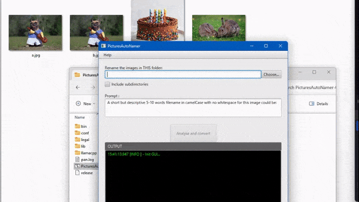

# PicturesAutoNamer

A Java frontend using llamacpp and local LLaVA LLM to **rename pictures according to their content**.

## FEATURES
* An user interface to choose a folder/subdirectories and display the progress
* Resize each picture (using [imgscalr](https://github.com/rkalla/imgscalr) lib)
* Connect to a local [llamacpp](https://github.com/ggerganov/llama.cpp) server running [LLaVA](https://llava.hliu.cc/)
* Send each picture to the server
* Rename the file after having cleaned up LLaVA's answer and accounted for duplicate
* Handle the case where the name chosen by LLaVA collide with an already existing name

Support jpg, png, bmp, webp thanks to the [TwelveMonkeys](https://github.com/haraldk/TwelveMonkeys) library.

## INSTALLATION
* Download the latest package [on the release page](https://gitlab.com/marclv/picturesautonamer/-/releases).
* Unzip the package.
* Download [mmproj-model-f16.gguf](https://huggingface.co/PsiPi/liuhaotian_llava-v1.5-13b-GGUF/blob/main/mmproj-model-f16.gguf).
* Download [ggml-model-q5_k.gguf](https://huggingface.co/mys/ggml_llava-v1.5-13b/blob/main/ggml-model-q5_k.gguf).
* Put the 2 downloaded models in llama/models.
* Launch PicturesAutoNamer.bat.
* Select a folder, press "Analyse and covert".

## TO DO
* More images formats (which ones?)
* Linux version
* "About" popup